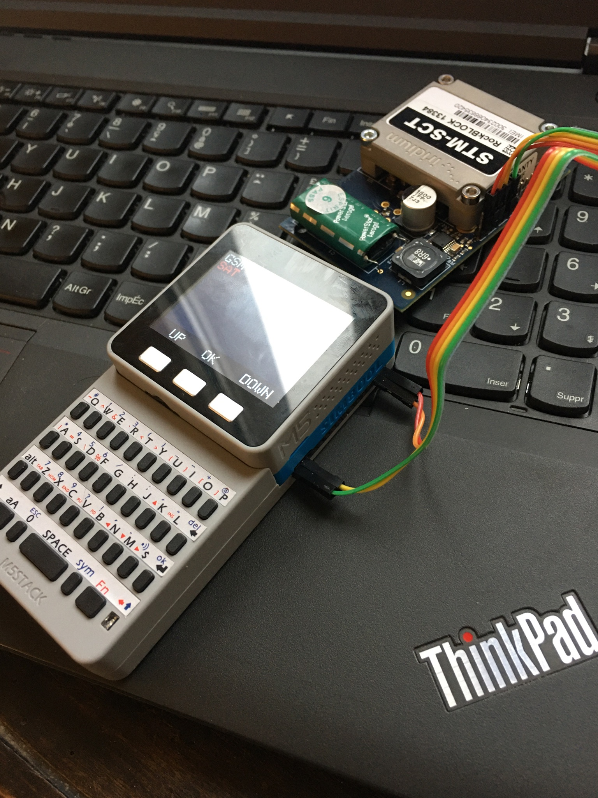

# Perrokey
Open source GSM &amp; Satellite communication device based on M5Stack
  
  

## What is this thing 

It's a small device for simple GSM and Satellite text communication, currently in early development. 
Future goals include messaging in following cases : 

* emergencies
* out-of-grid
* encrypted SMS 

## Requirements 

* [M5Stack + Faces module](https://m5stack.com/collections/m5-core/products/face)
* [M5Stack GSM Module](https://m5stack.com/collections/m5-module/products/gsm-sim800-module)
* [A RockBlock Satellite modem](https://www.rock7.com/products/rockblock-iridium-9602-satellite-modem) 

